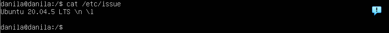

# Basic linux administration

Author — @Danila Shabanov

## Parts

* [Part 1. Installation of the OS](#Part 1. Installation of the OS)

## Part 1. Installation of the OS

> Installing **Ubuntu 20.04 Server LTS** without GUI.
> 

*screenshot of the command `cat /etc/issue`*

## Part 2. Creating a user

> Creating a new user. Adding user to `adm` group.
> 

Create a new user: `adduser <name>`

Create a new group: `groupadd <mygroup>`

Add a user in group: `usermod -aG <group_name> <user_name>`

Create user and add to group: `adduser [user] [group]`

Display a list of users in a group: `groups <user_name>`

*screenshot of the adding user `danila_adm` to group `adm`*

s*creenshot of the command `cat /etc/passwd`*

*screenshot of the command `groups danila_new`*

## Part 3. Setting up the OS network

> Setting the machine name as `user-1`
> 

Hostname stored in `/etc/hostname`

Hosts stored in `/etc/hosts`

Change name on `user-1`, and after reboot see the differences

s*creenshot of the commands: `cat /etc/hostname` and `cat /etc/hosts`*

> Setting the time zone corresponding to my current location.
> 

To check timezone run the command: `timedatecl`, timezone stored in /etc/timezone (on default —`Etc/UTC`)

To change time zone run: `timedatectl set-timezone Europe/Moscow`

s*creenshot of the changing timezone:*

> Outputting the names of the network interfaces using a console command.
> 

To work with the network environment in ubuntu, the `net-tools` utility is used

To see network configuration run: `ifconfig`

s*creenshot of the command: `ifconfig`:*

***Description***: enp0s3 (ethernet network periphera) — in charge of the external network. Interface lo (loopback, localhost), responsible for the internal network, it can be used by network client software to communicate with a server application located on the same computer, useful for testing services without compromising their security.

> Using the console command to get the ip address of the device I are working on from the DHCP server.
> 

To drop old ip run: `dhclient -r enp0s3`

To get new ip run: `dhclient -v enp0se`

s*creenshot of the command: `dhclient -r enp0se` and `ifconfig`*

s*creenshot of the commands: `dhclient -v enp0se` and `ifconfig`*

> Defining and display the external ip address of the gateway (ip) and the internal IP address of the gateway, aka default ip address (gw).
> 

To find external ip address use the website `2ip.ru`

To transfer a URL use the util `curl`

Gateway address can get with command: `route -n`

s*creenshot of the commands: `curl [https://2ip.ru](https://2ip.ru)` and `route -n`*

> Setting static (manually set, not received from DHCP server) ip, gw, dns settings (using public DNS servers, e.g. 1.1.1.1 or 8.8.8.8).
> 

On path `/etc/netplan/00-installer-config.yaml` stored network configurator.

s*creenshot of network config file before changes:*

Disable DHCP and set static ip addresses, gateway, DNS server addresses.

s*creenshot of network config file after changes:*

Run `sudo netplan apply` and `sudo netplan try` for apply changes.

> Rebooting the virtual machine. Making sure that the static network settings (ip, gw, dns) correspond to those set in the previous point.
> 

For reboot VM run: `reboot`

s*creenshot of the command: `ifconfig`*

s*creenshot of the commands: `ping -c 10 [1.1.1.1](https://1.1.1.1)` and `ping -c 10 ya.ru`*

## Part 4. OS Update

> Updating the system packages to the latest version
> 

Update option to resynchronize the package index files from their sources — `apt update` in file on path: `/etc/apt/sources.list`

Software packages with newer versions are updated and nothing is removed — `apt upgrade`

Some newer packages are installed and some are removed to satisfy certain dependencies — `apt dist-upgrade`

`apt` = most commonly used command options from `apt-get` and `apt-cache`, and `apt` has fewer but enough command options, but in a more organized way

s*creenshot of the commands: `sudo apt update` and `apt dist-upgrade`*

## Part 5. Using the **sudo** command

> Allowing user created in Part 2 to execute sudo command.
> 

Create file in directory /etc/sudoers.d/ and write next: `danila_adm ALL=(ALL:ALL) ALL`

SUDO (Substitute User And Do) — allows strictly defined users to run specified programs with administrative privileges without entering the root password.

s*creenshot of the commands: `hostname` and `sudo apt update` via danila_adm (user-2)*

## Part 6. Installing and configuring the time service

> Setting up the automatic time synchronisation service
> 

Download [NTP](https://en.wikipedia.org/wiki/Network_Time_Protocol): `apt install ntp`

To see all installed packages run: `dpkg -l` — package manager for Debian

For see that ntp is connected with servers run: `ntpq -p`.

Stop ntp-deamon: `systemctl stop ntp` → synchronyze time: `ntpd -gq` → start ntp-deamon: `systemctl start ntp` → check that ntp is working: `systemctl status ntp` and `ntpq -p`

If timedatectl show `System clock synchronized: yes` check [[this_link](https://serverfault.com/questions/1024770/ubuntu-20-04-time-sync-problems-and-possibly-incorrect-status-information)].

s*creenshot of the command: `timedatectl`:*

## Part 7. Installing and using text editors

> Installing **VIM** text editor (+ any two others if you like **NANO**, **MCEDIT**, **JOE** etc.
> 

> Using each of the three selected editors, creating a *test_X.txt* file, where X is the name of the editor in which the file is created. Writing my nickname in it, close the file and save the changes.
> 

VIM: (to exit: `:wq`)

Nano: (to exit: `^X` → `y` → `enter`)

MCEdit: (to exit: `esc esc`  → `yes`)

> Using each of the three selected editors, opening the file for editing, editing the file by replacing the nickname with the "21 School 21" string, closing the file without saving the changes.
> 

VIM: (to exit without save: `:q!`)

Nano: (to exit without save: `^X` → `n`)

MCEdit: (to exit without save: `esc esc` → `no`):

> Using each of the three selected editors, editing the file again (similar to the previous point) and then master the functions of searching through the contents of a file (a word) and replacing a word with any other one.
> 

VIM: (to change word in current line `:s:21:12:g`, in all file `:%s:21:12:g`)

Nano: (to change word in all file `^W` → `21` → `^R` → `enter` → `12` → `A`, in current select `^W` → `21` → `^R` → `enter` → `12` → `Y`)

MCEdit: (to change word in all file: `f4` → `All`):

## Part 8. Installing and basic setup of the **SSHD** service

> Installing the SSHd service
> 

*screenshot of the command `ps aux | grep sshd`*

> Reseting the SSHd service to port 2022
> 

*screenshots of ports setting on VM:*

s*creenshots of the ssh config `/etc/ssh/sshd_config` file:*

*screenshot for setting firewall:*

Run the command `service sshd restart` and you can try ssh connection!

*screenshot of the ssh config file `/etc/ssh/sshd_config` and discart password authentication:*

*screenshot of the PuTTY menu and connection settings:*

s*creenshot of the command: `netstat -tan`*

*screenshots meaning of the -tan keys from man-sheet:*

## Part 9. Installing and using the **top**, **htop** utilities

> Installing and run the top and htop utilities
> 

s*creenshot of the command: `top`*

- uptime — time since launch ubuntu
- number of authorised users — if user login in other tty, counter will increment
- total system load — on my VM allocated one processor core → The CPU (170%) utilized on average; 1 processes was running on the CPU (1.70) over the last 1 minute; The CPU was idle by 31% on average; no processes were waiting for CPU time (0.69) over the last 5 minutes; The CPU was overloaded by 25% on average; 0.25 processes were waiting for CPU time (0.25) over the last 15 minutes.
- total number of processes — total, running, sleeping, stopped, zombie (processes that have completed their execution, but their entries are not removed from the process table) number of processes
- cpu load — us (user) - time running un-niced user processes ([nice and un-nice](https://askubuntu.com/questions/812144/what-exactly-is-meant-by-a-niced-and-an-un-niced-user-process)); sy (system) - time running kernel processes; ni (nice) - time running niced user processes; id (idle) - time spent in the kernel idle handler; wa (IO-wait) - time waiting for I/O completition; hi - time spent servicing hardware interrupts; si - time spent servicing hardware interrupts; st - time stolen from this vm by the hypervisor
- memory load — mebibyte = 1024 KiB - they indicate total, used and free amounts of the memory. The buffer and cache information is present here too.
- pid of the process with the highest memory usage — you can sort by memory using the `Shift + M` hotkey, write the ID of the topmost process into the report (numbers on the left in the PID column)
- pid of the process taking the most CPU time — this is the same basic sorting that we originally had. So let's exit top with the q key and run top again → first process is taking the most CPU time

`htop:`

*screenshot for sorted by PID:*

*screenshot for sorted by PERCENT_CPU:*

*screenshot for sorted by PERCENT_MEM:*

*screenshot for sorted by TIME:*

*screenshot for filtered for sshd process:*

*screenshot with the syslog process found by searching:*

*screenshot with hostname, clock and uptime output added:*

For `space` can change style of the column.

## Part 10. Using the **fdisk** utility

> Running the fdisk -l command
> 

**`fdisk`** is a [command-line](https://en.wikipedia.org/wiki/Command-line) [utility](https://en.wikipedia.org/wiki/Utility_software) for [disk partitioning](https://en.wikipedia.org/wiki/Disk_partitioning).

-l → list the partition tables for the specified devices and then exit.

*screenshot of the command `fdisk -l`:*

- name of the hard disk — `/dev/sda`
- its capacity **— `4.15 GiB`
- number of sectors — `8683520`

## Part 11. Using the **df** utility

> Running the df command
> 

`df` (abbreviation for ***d**isk **f**ree*) is a standard [Unix](https://en.wikipedia.org/wiki/Unix) command used to display the amount of available disk space for [file systems](https://en.wikipedia.org/wiki/File_system) on which the invoking [user](https://en.wikipedia.org/wiki/User_(computing)) has appropriate read access. df is typically implemented using the [statfs](https://en.wikipedia.org/w/index.php?title=Statfs&action=edit&redlink=1) or statvfs [system calls](https://en.wikipedia.org/wiki/System_call).

*screenshot of the command `df /`:*

- partition size — `4191096 1K-blocks`
- space used — `3541236 1K-blocks`
- space free — `416388 1K-blocks`
- percentage used — `90%`

> Running the df -Th command
> 

-T → print file system type

-h → print human-readable format

*screenshot of the command `df -Th /`:*

- partition size — `4.0G`
- space used — `3.4G`
- space free — `407M`
- percentage used — `90%`

## Part 12. Using the **du** utility

> Running the du command
> 

**`du`** (abbreviated from ***d**isk **u**sage*) is a standard [Unix](https://en.wikipedia.org/wiki/Unix) [program](https://en.wikipedia.org/wiki/Computer_program) used to estimate file space usage—space used under a particular [directory](https://en.wikipedia.org/wiki/Directory_(computing)) or [files](https://en.wikipedia.org/wiki/Computer_file) on a [file system](https://en.wikipedia.org/wiki/File_system).

*screenshot of the command `du`:*

> Outputting the size of all contents in /var/log (not the total, but each nested element using *)
> 

-b → scale sizes by 1

*screenshot of the command `du -bh /var/log/*`:*

## Part 13. Installing and using the **ncdu** utility

> Installing the ncdu utility
> 

**ncdu** (**[NC**urses](https://en.wikipedia.org/wiki/NCurses) **D**isk **U**sage) is a [disk utility](https://en.wikipedia.org/wiki/Disk_utility) for [Unix](https://en.wikipedia.org/wiki/Unix) systems. Its name refers to its similar purpose to the [du](https://en.wikipedia.org/wiki/Du_(Unix)) utility, but ncdu uses a [text-based user interface](https://en.wikipedia.org/wiki/Text-based_user_interface).

*screenshot of the command `apt install ncdu`:*

> Outputting the size of the `/home`, `/var`, `/var/log` folders
> 

*screenshot of the outputting information from `ncdu` in `/` path:*

*screenshot of the outputting information from `ncdu` in `/home` path:*

*screenshot of the outputting information from `ncdu` in `/var` path:*

*screenshot of the outputting information from `ncdu` in `/var/log` path:*

## Part 14. Working with system logs

> Openning for viewing:
> 
- 1. `/var/log/dmesg`

- 2. `/var/log/syslog`

- 3. `/var/log/auth.log`

- last successful login time, user name and login method:

login time — `19:48:08`

user name — `danila`

login method — `tty=pts/0`

Restart SSHd service — `service sshd restart`, service restart message — `tail /var/log/syslog` 

screenshot of the commands `service sshd restart` and `tail /var/log/syslog`

## Part 15. Using the **CRON** job scheduler

> Using the job scheduler, running the uptime command in every 2 minutes
> 

The **`cron`** command-line utility is a [job scheduler](https://en.wikipedia.org/wiki/Job_scheduler) on [Unix-like](https://en.wikipedia.org/wiki/Unix-like) [operating systems](https://en.wikipedia.org/wiki/Operating_system). Users who set up and maintain software environments use cron to schedule jobs (commands or [shell scripts](https://en.wikipedia.org/wiki/Shell_script)), also known as **cron jobs**, to run periodically at fixed times, dates, or intervals. It typically automates system maintenance or administrationthoughitsgeneralpurposenaturemakes it useful for things like downloading files from the [Internet](https://en.wikipedia.org/wiki/Internet) and downloading [email](https://en.wikipedia.org/wiki/Email) at regular intervals.

-e → edit the current crontab using the editor specified by the VISUAL or EDITOR environment variables.

*screenshot of the command `crontab -e`*

*screenshot after select editor (vim):*

*screenshot after waiting 4 minutes:*

s*creenshot of the command: `tail /var/log/syslog`*

---
